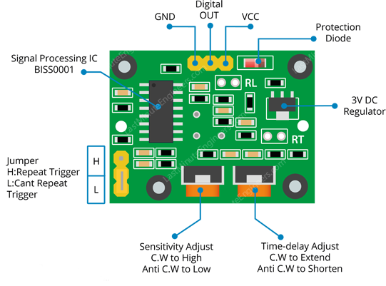

Python scripts for HC-SR501 motion detector on Beaglebone Black

| Board pin name | Board pin | Beaglebone Black pin name |
|----------------|-----------| --------------------------|
| GND            | 1         | P9\_1, Ground             |
| OUT            | 2         | P9\_12, GPIO              |
| VCC            | 3         | P9\_05, VDD\_5v           |

